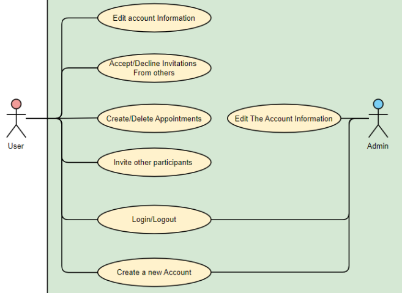
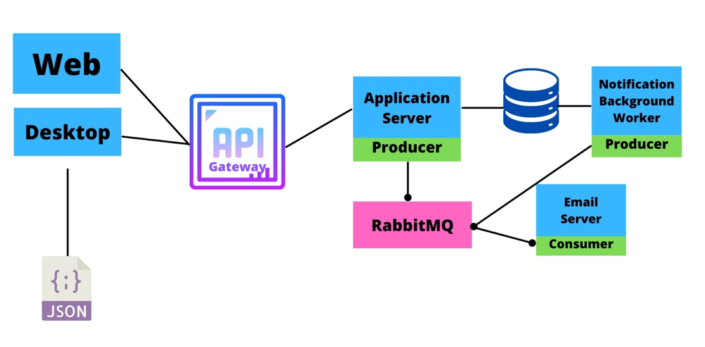
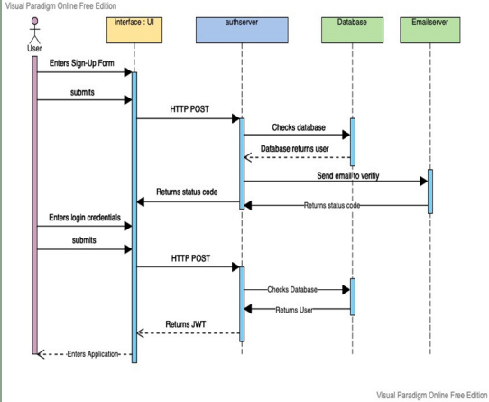
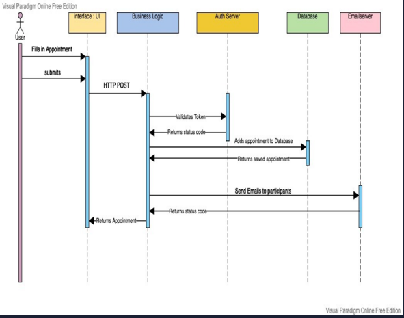

# PIB-VS_WiSe21_Gruppe07

# Verteilter Terminkalender (Zaman)

Dies ist ein abschließendes Gruppenprojekt im Rahmen der Vorlesung Verteilte Systeme im 
fünften Semester. Unsere Aufgabe ist es, einen Dienst zur Verwaltung von Terminkalendern zu 
implementieren, sodass jeder Nutzer seinen eigenen Terminkalender bereitgestellt bekommt und 
Funktionen ausführen kann wie hinzufügen, entfernen und ändern eines Termins bzw. Termine abfragen kann. 
Zusätzlich soll der Dienst dem Nutzer ermöglichen, dass dieser andere Nutzer zu einem Termin einladen kann. Der Eingeladene kann sie dann annehmen oder ablehnen.

## Architektur

Die Verwendung von Microservices ermöglicht Flexibilität innerhalb eines 
individuellen Services sowie Skalierbarkeit als auch Leichte Kopplung innerhalb des Systems, somit kann man wie gebraucht neue Anwendungskomponenten bauen.
Bei einem Ausfall oder Fehler eines Services, sind die anderen nicht betroffen, da sie nicht
abhängig voneinander sind. Jedes Modul erfüllt seine eigene Aufgabe.

Unsere Microservices:
* zaman_application_service
* zaman_gateway_service
* zaman_mail_service
* zaman_worker_service

Weitere vorhandene Module:
* zaman_desktop (JavaFX Oberfläche)
* zaman_resource_service (Auslagerung wiederholender Ressourcecodes)
* zaman_web_client (E-Mail- und Webfunktionen)

Java Spring erleichtert uns die Entwicklung mit Microservices und automatisiert die Konfiguration neuer Dependencies.
Außerdem ermöglicht uns docker eine einfache orchestrierung aller Microservices durch container. 
Durch Docker erschaffen wir eine Virtualisierung der gesamten Umgebung. Innerhalb von Multi-Container
werden alle Anwendungen, die für die Ausführung unseres Projektes benötigt werden, durch die _docker-compose.yml_ automatisch
heruntergeladen und installiert.

Innerhalb der Microservices verwenden wir eine Event-basierte Architektur
mit dem Messaging Protokoll RabbitMQ, da diese bei Microservices Vorteile bringt beim auftreten 
von Domain-Events. Unsere einzelnen Services kommunizieren asynchron miteinander.
Wenn also in einem unserer Microservices ein Ereignis auftritt, werden entsprechende Konsumenten
darüber informiert. Wir gewährleisten dadurch auch eine unblockbare Kommunikation (non-blocking).

Der client kommuniziert jedoch durch HTTP mit dem API-Gateway der als Einfahrt für 
alle Request außerhalb der Microservices dient.

Unsere Anwendung besitzt eine grafische Oberfläche, die im Desktop
mit JavaFX erstellt ist und ein Webclient, der im Browser
durch HTML dargestellt ist.

#### Use Cases

#### Anforderungen

Es haben sich folgende Anforderungen durch die Use Cases ergeben:

###### Funktionale Anforderungen

###### Must-have:
* Benutzer Account erstellen (✓), ändern, löschen
* Login/Logout (✓)
* Termin erstellen (✓), ändern, löschen
* User soll andere einladen können (✓)
* Einladungen annehmen oder ablehnen (✓)

###### Schould-Have:
* Termin eines gegebenen Zeitraumes abfragen
* Terminersteller darf Termin absagen
* E-Mail Benachrichtigungen (✓)
* Passwort ändern / Passwort zurücksetzen

###### Could-Have:
* Push-Benachrichtigungen
* Benachrichtigungen aktivieren/deaktivieren
* Benachrichtigungen speichern und entfernen können
* Posteingang öffnen
* Account freischalten durch E-Mail Verifikation (✓)
* prüfen, ob Nutzer für Termin verfügbar ist

###### Nichtfunktionale Anforderungen
* Benutzerfreundlichkeit
* Übersichtlichkeit
* Erweiterbarkeit
* Portabilität
* Sicherheit

#### Lösungsstrategie

Wir gewährleisten eine Menge an Transparancy Aspekte durch unser Software System.
Durch unsere Microservice Architektur und unserem API-Gateway gewährleisten wir, 
dass der User nichts von unseren Microservices weiß, also nicht wo sie liegen 
und wer für was zuständig ist (Location Transparency).
RabbitMQ hat die besondere Eigenschaft, dass auch wenn unsere Queue ausfällt, z.b. durch Stromausfall,
während sie eine Nachricht enthält, diese nicht gelöscht wird, sondern sofort konsumiert wird sobald der Strom wieder aktiv ist.
Damit gewährleisten wir Failure Transparency.
Unser Worker Service gibt uns ein gutes Beispiel eines concurrent Transparency. Unser Worker Service arbeitet alleine
und unabhängig und gleichzeitig arbeitet der Application Service ohne den Worker Service zu blocken oder aufzuhalten.

Als Softwarearchitektur innerhalb der Microservices nutzen wir gerne das Service Repository Design Pattern.
Dieses Design Pattern erlaubt uns eine saubere Trennung der Business Logik und des Data Layers.
Durch JPA haben wir ausserdem den Vorteil, unabhängig des Speichermediums zu programmieren d.h. wir können von MYSQL gerne zu PostgreSQL oder MongoDB wechseln, ohne besonders viel am code zu ändern. Innerhalb des Clients benutzen wir Dependency Injection + Service Repository Pattern um Testbarkeit zu gewährleisten.

Als Systemarchitektur benutzen wir die Microservice-Architektur, dabei haben wir uns streng nach den Richtlinien von [Martin Fowler](https://martinfowler.com/articles/microservices.html) gerichtet, um eine saubere Planung und Implementierung zu erreichen.

Innerhalb der Microservices haben wir ein asynchrones Request-Reply Pattern da alle durch unser RabbitMQ kommunizieren. Der Mail Service dient lediglich als Konsument und Ppplication + Worker Service als Produzenten. Client -> Gateway -> Application Service haben ein synchrones Request-Reply Pattern durch HTTP.

Unser client ist ein Thin-Client, da dies abhängig von server agiert, wir besitzen keinen Cache oder Localstorage der im falle von trennung des Netzwerkes als Data Store dient.

Wir besitzen ein stateless server Design. Unser Client speichert einen Token, der für die Authentifizierung der Requests dient. Unsere Microservices sind jedoch nicht abhängig voneinander oder halten irgendwelche session-basierte informationen. 

Unser Softwaresystem ist außerdem idempotent, da der Client unabhängig davon, ob der server läuft oder nicht, die entsprechende Antwort erhält. Der Client kann also immer denselben Aufruf machen, ohne sich dabei zu sorgen was der vorherige Aufruf zurückgab. 

Skalierbarkeit ist durch unsere asynchrone Kommunikation und der Gateway Implementierung gewährleistet, d.h. wenn wir weitere Microservices aufstellen wollen, sind wir durch unsere leichte Kopplung dadurch in der Lage. 

Die verwendete Programmiersprache ist Java (Version 11). Für den Webclient wurden auch HTML, CSS und JavaScript verwendet.
Für die Datenbank traf unsere Wahl auf MySQL

#### Statisches Modell

###### Komponentendiagramm

###### Paketdiagramm

Das Projekt ist unterteilt in die Pakete Präsentation, Projektmanagement und Entwicklung. Entwicklung wiederum in Frontend, System und die unterschiedlichen Services.

###### Klassendiagramm
Dargestellte Klassen sind der Benutzer und der Termin, ein Termin beinhaltet auch eine Location und ein Label mit ihren eigenen Attributen.

#### Dynamisches Modell
Beschreiben Sie den Ablauf Ihres Programms in Form von:

###### Sequenzdiagramme

Login-Signin

Erstellung eines Termins

## Getting Started
Dokumentieren Sie, wie man ihr Projekt bauen, installieren und starten kann.

Bei der Verwendung von Docker wird einem viel abgenommen. Somit muss z.B. MySQL nicht auf dem Rechner installiert
sein, das erledigt Docker.
Für das Ausführen muss Docker erst installiert sein. Beim Windows Betriebssystem wird noch zusätzlich ein Linux-Subsystem wie WSL2 gebraucht.
Wenn Docker nun Startklar ist, geht es weiter.

#### Vorraussetzungen
* Docker
* Internetverbindung

#### Installation und Deployment
Im Pfad \PIB-VS_WiSe21_Gruppe07, also am Anfang des Projektordners, befindet sich
eine docker-compose.yml-Datei. Im Terminal
wird somit in diesem Pfad ein Docker-Kommando ausgeführt, nämlich ``docker-compose up``.
Danach starten sämtliche Installationen.
Dann können Sie die JavaFX Anwendung zum laufen bringen, über die Main.

## Built With

* [GitHub](https://github.com/) - Entwicklungsplattform
* [Java Spring](https://spring.io/) - Framework für die Nutzung von Microservices
* [Maven](https://maven.apache.org/) - Dependency Management
* [Docker](https://www.docker.com/) - Containerbasierte Virtualisierung
* [JavaFX](https://openjfx.io/) - für die Benutzeroberfläche der Anwendung
* [SceneBuilder](https://gluonhq.com/products/scene-builder/) - Vereinfachung von JavaFX-Views
* [MySQL](https://www.mysql.com/de/) - Datenbank
* [RabbitMQ](https://www.rabbitmq.com/) - Framework Messagebroker, Kommunikationstechnologie
* [JSON Web Token (JWT)](https://jwt.io/) - Austausch zwischen Client und Server
* [H2 Database](https://www.h2database.com/html/main.html) - Datenbankmanagement

## License

PIB-VS_WiSe21_Gruppe07

## Acknowledgments

[Solid](https://cruip.com/solid/?msclkid=3f4e146faaca11ec83a8900af1591bc0) - HTML Template für die Webseite (index.html)
